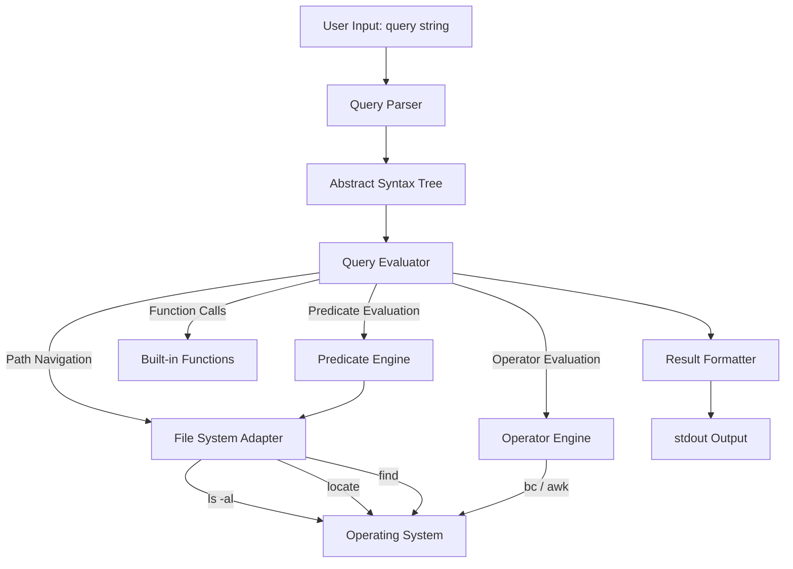
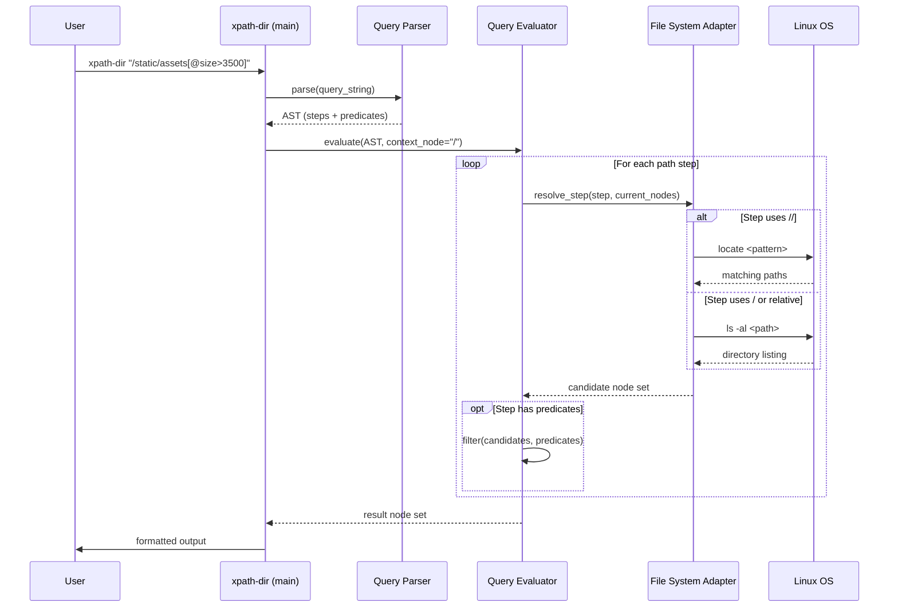

# Design Document: xpath-dir

## Overview

**xpath-dir** is a Linux bash shell script that enables querying file directory structures using XPath-like syntax, adapted from the W3C XPath specification for XML. Instead of querying XML documents, it treats the file system as a tree of nodes where directories are branch nodes, files are leaf nodes, and file metadata (from `ls -al`) serves as attributes.

The script accepts a single query string argument (`xpath-dir <query-string>`), parses it into an internal representation, evaluates it against the live file system, and returns matching nodes or attribute values. For deep recursive searches (`//`), it leverages the `locate` command for performance rather than walking the tree with `ls`.

The design prioritizes reuse of existing bash/Linux tools (e.g., `awk`, `sed`, `grep`, `locate`, `find`) over custom implementations, especially for operators and built-in functions, keeping the script concise.

## Architecture



### Data Flow



## Components and Interfaces

### Component 1: Query Parser

**Purpose**: Tokenizes and parses the XPath query string into a structured representation (AST) that the evaluator can walk.

**Interface**:
```bash
# parse_query(query_string) -> sets global AST arrays
# Populates:
#   STEPS[]       - array of path steps (e.g., "static", "assets")
#   STEP_AXES[]   - axis for each step: "child", "descendant", "parent", "attribute", "self"
#   PREDICATES[]  - predicate expressions per step (empty string if none)
#   QUERY_TYPE    - "absolute" | "relative"
```

**Responsibilities**:
- Tokenize the query string into path steps separated by `/` or `//`
- Identify axis specifiers: `/` (child), `//` (descendant-or-self), `..` (parent), `.` (self), `@` (attribute)
- Extract predicate expressions from `[...]` brackets
- Handle wildcards: `*`, `@*`, `node()`
- Handle the union operator `|` by splitting into sub-queries
- Validate basic syntax and report errors to stderr

### Component 2: File System Adapter

**Purpose**: Abstracts all interactions with the Linux file system, translating node-tree concepts into actual OS commands.

**Interface**:
```bash
# list_children(path) -> outputs child nodes with attributes
#   Uses: ls -al <path>
#   Output format: one line per node with all attributes

# search_descendants(pattern, base_path) -> outputs matching paths
#   Uses: locate <pattern> | grep "^<base_path>"
#   Fallback: find <base_path> -name <pattern>

# get_attributes(path) -> outputs attribute key=value pairs
#   Parses ls -al output into: permissions, item_count, group, user, size, datetime, name, type

# resolve_node(path) -> outputs node type and existence
#   Returns: "file", "directory", "symlink", or "not_found"
```

**Responsibilities**:
- Execute `ls -al` for direct child listing and attribute retrieval
- Execute `locate` for `//` descendant searches (with `find` fallback if locate DB is stale)
- Parse `ls -al` output into structured attribute fields
- Handle symlinks (detect via `l` prefix in permissions)
- Handle date/time format variations (`Apr 22 11:34` vs `Jul 18  2025`)
- Normalize paths (resolve `.`, `..`, `~`)

### Component 3: Query Evaluator

**Purpose**: Walks the AST and evaluates each step against the file system, building up the result node set.

**Interface**:
```bash
# evaluate(context_path) -> outputs matching nodes
#   Reads global AST arrays set by parser
#   Iterates through STEPS[], resolving each against the file system
#   Applies predicates at each step to filter candidates

# evaluate_step(step, axis, context_nodes) -> outputs candidate nodes
#   Resolves a single path step given an axis and set of context nodes

# apply_predicate(predicate_expr, candidate_nodes) -> outputs filtered nodes
#   Evaluates predicate expression against each candidate
```

**Responsibilities**:
- Maintain a current node set (context) as it walks path steps
- For each step, expand the node set according to the axis
- Apply predicates to filter the expanded set
- Handle union operator `|` by evaluating sub-queries and merging results
- Pass function calls to the Built-in Functions component
- Pass operator expressions to the Operator Engine

### Component 4: Predicate Engine

**Purpose**: Evaluates predicate expressions within `[...]` brackets to filter node sets.

**Interface**:
```bash
# eval_predicate(expression, node_path, position, total) -> returns 0 (true) or 1 (false)
#   expression: the predicate string (e.g., "@size>3500", "position()<3", "1")
#   node_path: path of the node being tested
#   position: 1-based position of node in current set
#   total: total number of nodes in current set
```

**Responsibilities**:
- Numeric predicates: `[1]`, `[3]` — match by position
- Position functions: `last()`, `position()`
- Attribute tests: `[@attr]` (existence), `[@attr='value']` (equality), `[@attr>value]` (comparison)
- Compound predicates with `and`, `or`
- Delegate attribute lookups to File System Adapter
- Delegate comparisons to Operator Engine

### Component 5: Operator Engine

**Purpose**: Evaluates arithmetic, comparison, and logical operators by delegating to existing bash tools.

**Interface**:
```bash
# eval_operator(left, op, right) -> outputs result
#   Delegates to bc, awk, or bash test expressions
#   Supported ops: +, -, *, div, mod, =, !=, <, <=, >, >=, or, and
```

**Responsibilities**:
- Arithmetic (`+`, `-`, `*`, `div`, `mod`): delegate to `bc` or `awk`
- Comparison (`=`, `!=`, `<`, `<=`, `>`, `>=`): use bash `[[ ]]` or `awk`
- Logical (`or`, `and`): combine boolean results
- String comparisons vs numeric comparisons (auto-detect)

### Component 6: Built-in Functions

**Purpose**: Implements XPath built-in functions adapted for file system context.

**Interface**:
```bash
# call_function(func_name, args...) -> outputs result
#   Dispatches to the appropriate function implementation
```

**Responsibilities**:
- Positional: `position()`, `last()`, `count()`
- String: `string-length()`, `contains()`, `starts-with()`, `substring()`, `concat()`, `normalize-space()`
- Numeric: `sum()`, `floor()`, `ceiling()`, `round()`, `number()`
- Boolean: `boolean()`, `not()`, `true()`, `false()`
- File/dir: `name()`, `node()` — return node name or type
- Delegate heavy computation to `awk`, `sed`, `grep` where possible

### Component 7: Result Formatter

**Purpose**: Formats the final node set for output to stdout.

**Interface**:
```bash
# format_results(node_paths[], query_type) -> outputs to stdout
#   query_type informs whether to show attributes, paths, or values
```

**Responsibilities**:
- For node selections: output full paths (one per line)
- For attribute selections (`@`): output attribute values
- For wildcard attribute selections (`@*`): output all attributes in key=value format
- Handle empty result sets gracefully (no output, exit 0)

## Data Models

### Node Representation

```bash
# A node is represented as a set of associative array entries keyed by path.
# NODE_TYPE[path]       = "file" | "directory" | "symlink" | "root"
# NODE_NAME[path]       = basename of the path
# NODE_PARENT[path]     = parent directory path

# Attributes (parsed from ls -al):
# ATTR_PERMISSIONS[path] = "drwxr-xr-x" | "-rwxr-xr-x" | "lrwxrwxrwx" ...
# ATTR_ITEM_COUNT[path]  = integer (number of items / hard links)
# ATTR_GROUP[path]       = string (group name)
# ATTR_USER[path]        = string (user name)
# ATTR_SIZE[path]        = integer (size in bytes)
# ATTR_DATETIME[path]    = string (last modification date/time)
# ATTR_NAME[path]        = string (file/directory name)
# ATTR_LINK_TARGET[path] = string (symlink target, empty if not symlink)
```

**Validation Rules**:
- `path` must be an absolute resolved path (no `.` or `..` remaining)
- `ATTR_ITEM_COUNT` must be a non-negative integer
- `ATTR_SIZE` must be a non-negative integer
- `ATTR_PERMISSIONS` must be a 10-character string matching pattern `[dlcbps-][rwxsStT-]{9}`
- `ATTR_DATETIME` must match either `Mon DD HH:MM` or `Mon DD  YYYY` format

### AST Representation

```bash
# The parsed query is stored in parallel arrays:
# STEPS[i]       = "static" | "assets" | "*" | "node()" | ...
# STEP_AXES[i]   = "child" | "descendant" | "parent" | "self" | "attribute"
# PREDICATES[i]  = "" | "1" | "last()" | "@size>3500" | "@user='John' and @size>1000"
# QUERY_TYPE     = "absolute" | "relative"
# UNION_QUERIES  = number of sub-queries (for | operator)
```

### Attribute Name Mapping

| XPath Attribute Name | ls -al Column | Example Value |
|---|---|---|
| `@permissions` | Column 1 | `drwxr-xr-x` |
| `@item-count` | Column 2 | `8` |
| `@group` | Column 3 | `group` |
| `@user` | Column 4 | `user` |
| `@size` | Column 5 | `4096` |
| `@datetime` | Columns 6-8 | `Apr 22 11:34` |
| `@name` | Column 9 | `static` |
| `@type` | Derived from col 1 | `file` / `directory` / `symlink` |

## Error Handling

### Error Scenario 1: Invalid Query Syntax

**Condition**: Query string cannot be parsed (unmatched brackets, empty steps, invalid characters)
**Response**: Print error message to stderr with position indicator, exit code 1
**Recovery**: User corrects query and re-runs

### Error Scenario 2: Path Not Found

**Condition**: A path step resolves to a non-existent file system path
**Response**: Return empty result set (no output), exit code 0
**Recovery**: Consistent with XPath behavior — non-matching queries return empty sets

### Error Scenario 3: Permission Denied

**Condition**: User lacks read permission on a directory or file
**Response**: Print warning to stderr for the inaccessible path, skip it, continue evaluation
**Recovery**: Partial results returned for accessible paths

### Error Scenario 4: locate Database Not Available

**Condition**: `locate` command not installed or database not updated when `//` is used
**Response**: Fall back to `find` command with a warning to stderr
**Recovery**: Functionally correct but potentially slower

### Error Scenario 5: Invalid Predicate Expression

**Condition**: Predicate contains unsupported function or malformed expression
**Response**: Print error to stderr identifying the predicate, exit code 1
**Recovery**: User corrects predicate syntax

## Testing Strategy

### Unit Testing Approach

Test each component in isolation using bash test scripts (e.g., with `bats` testing framework):

- **Parser tests**: Verify AST output for various query patterns — absolute paths, relative paths, `//`, predicates, wildcards, unions
- **File System Adapter tests**: Use a controlled temp directory with known structure; verify `list_children`, `search_descendants`, `get_attributes` output
- **Predicate Engine tests**: Test numeric predicates, position functions, attribute comparisons, compound expressions
- **Operator Engine tests**: Verify arithmetic, comparison, and logical operations against expected results
- **Built-in Function tests**: Test each function with known inputs/outputs

### Property-Based Testing Approach

**Property Test Library**: `bats` with generated inputs

- **Roundtrip property**: For any existing file path, `xpath-dir` with the absolute path of that file should return exactly that file
- **Subset property**: Results of `/path/subdir/*` should be a subset of results of `/path/subdir//*`
- **Idempotence**: Running the same query twice yields identical results (file system unchanged)
- **Position consistency**: For any node set of size N, predicates `[1]` through `[N]` should each return exactly one distinct node, and together cover the full set

### Integration Testing Approach

- Create a known directory tree in `/tmp` matching the example from SPECs.md
- Run full end-to-end queries from the spec examples and verify output
- Test `//` queries with both `locate` available and unavailable (fallback to `find`)
- Test with symlinks, empty directories, files with special characters in names
- Test permission-denied scenarios with restricted directories

## Performance Considerations

- **`//` queries**: Must use `locate` command for descendant searches to avoid expensive recursive `ls` traversal. The `locate` database should be reasonably up-to-date (`updatedb` run periodically by cron)
- **Large directories**: For directories with thousands of entries, `ls -al` output parsing should stream through `awk` rather than loading into memory
- **Predicate evaluation**: Predicates should short-circuit on `and`/`or` expressions
- **Caching**: Within a single query evaluation, cache `ls -al` results for paths already visited to avoid redundant OS calls
- **Operator delegation**: Using `bc`/`awk` for arithmetic avoids bash integer limitations and keeps the script small

## Security Considerations

- **Input sanitization**: The query string must be sanitized before being passed to any shell command (`ls`, `locate`, `find`) to prevent command injection. Special characters (`;`, `|`, `&`, `` ` ``, `$`, `(`, `)`) in node names must be properly escaped
- **Path traversal**: `..` navigation should be bounded — it should not allow escaping a chroot or accessing paths the user doesn't have OS-level permission to read
- **No write operations**: xpath-dir is strictly read-only; it must never modify the file system
- **Symlink handling**: Symlinks should be reported but not followed infinitely (detect cycles)

## Correctness Properties

*A property is a characteristic or behavior that should hold true across all valid executions of a system — essentially, a formal statement about what the system should do. Properties serve as the bridge between human-readable specifications and machine-verifiable correctness guarantees.*

### Property 1: Query parsing round-trip

*For any* valid XPath query string, parsing it into an AST and reconstructing the query from the AST components (steps, axes, predicates, query type) SHALL produce a string that, when parsed again, yields an identical AST.

**Validates: Requirements 1.1, 1.2, 1.3, 1.4, 1.7, 1.8, 1.9**

### Property 2: Attribute parsing completeness

*For any* valid `ls -al` output line (covering both datetime formats `Mon DD HH:MM` and `Mon DD  YYYY`, and all node types including files, directories, and symlinks), the Adapter SHALL extract exactly 8 attribute fields (permissions, item-count, group, user, size, datetime, name, type) with correct values.

**Validates: Requirements 2.4, 2.5, 2.6, 2.7, 8.1, 8.2, 8.3, 8.4, 8.5, 8.6, 8.7, 8.8**

### Property 3: Path normalization

*For any* path containing `.`, `..`, or `~` components, the Adapter SHALL produce an absolute path with no relative components remaining, and the normalized path SHALL refer to the same file system location as the original.

**Validates: Requirement 2.8**

### Property 4: Self axis is identity

*For any* node set, evaluating the `.` (self) axis step SHALL return the same node set unchanged.

**Validates: Requirement 3.6**

### Property 5: Parent axis correctness

*For any* node that is not the root, evaluating the `..` (parent) axis step SHALL return the node's parent directory, and the original node SHALL be a child of that parent.

**Validates: Requirement 3.5**

### Property 6: Child axis subset of descendant axis

*For any* directory path and step name, the set of nodes returned by the child axis SHALL be a subset of the nodes returned by the descendant axis for the same step name from the same context.

**Validates: Requirements 3.3, 3.4, 7.1, 7.4**

### Property 7: Union is set union

*For any* two valid sub-queries A and B, the result of `A | B` SHALL equal the union of the results of evaluating A independently and evaluating B independently.

**Validates: Requirement 3.8**

### Property 8: Positional predicate consistency

*For any* node set of size N, applying positional predicates `[1]` through `[N]` SHALL each return exactly one distinct node, `[last()]` SHALL return the same node as `[N]`, and `position()` for each node SHALL equal its 1-based index.

**Validates: Requirements 4.1, 4.2, 4.3, 4.4**

### Property 9: Attribute predicate filtering correctness

*For any* node set and attribute comparison predicate (existence, equality, or relational), the filtered result SHALL contain exactly those nodes whose attribute value satisfies the predicate condition, and no others.

**Validates: Requirements 4.5, 4.6, 4.7**

### Property 10: Compound predicate logical correctness

*For any* node set and compound predicate using `and` or `or`, the filtered result SHALL equal the intersection (for `and`) or union (for `or`) of the results of applying each sub-predicate independently.

**Validates: Requirement 4.8**

### Property 11: Operator evaluation correctness

*For any* pair of numeric operands and arithmetic operator (`+`, `-`, `*`, `div`, `mod`), the Operator_Engine SHALL return the mathematically correct result. *For any* pair of operands and comparison operator, the Operator_Engine SHALL return the correct boolean. *For any* pair of boolean operands and logical operator (`and`, `or`), the Operator_Engine SHALL return the correct logical result.

**Validates: Requirements 5.1, 5.2, 5.3, 5.4, 5.5**

### Property 12: String function correctness

*For any* input string, each string function (`string-length`, `contains`, `starts-with`, `substring`, `concat`, `normalize-space`) SHALL produce results consistent with the standard XPath string function definitions.

**Validates: Requirement 6.2**

### Property 13: Numeric function correctness

*For any* input number, each numeric function (`sum`, `floor`, `ceiling`, `round`, `number`) SHALL produce the mathematically correct result.

**Validates: Requirement 6.3**

### Property 14: Wildcard attribute completeness

*For any* node, evaluating `@*` SHALL return all 8 defined attributes (permissions, item-count, group, user, size, datetime, name, type) in key=value format.

**Validates: Requirements 7.2, 9.3**

### Property 15: Non-existent path yields empty result

*For any* query that references a path not present in the file system, the Script SHALL produce no output on stdout and exit with code 0.

**Validates: Requirements 3.9, 9.4, 10.2**

### Property 16: Invalid query yields error

*For any* syntactically invalid query string (unmatched brackets, empty steps, malformed predicates), the Script SHALL print an error to stderr and exit with code 1, producing no output on stdout.

**Validates: Requirements 1.11, 10.1, 10.4**

### Property 17: Command injection prevention

*For any* query string containing shell injection characters (`;`, `&`, backticks, `$()`, `<`, `>`, `(`, `)`), the Script SHALL sanitize the input such that no injected commands are executed by the underlying shell.

**Validates: Requirement 11.1**

### Property 18: Read-only invariant

*For any* query execution, the file system state after execution SHALL be identical to the state before execution — the Script SHALL never create, modify, or delete any file or directory.

**Validates: Requirement 11.2**

### Property 19: Locate/find equivalence

*For any* `//` descendant query, the result set when using `locate` SHALL be identical to the result set when using `find` as fallback.

**Validates: Requirements 12.3, 12.4**

## Dependencies

| Dependency | Purpose | Required |
|---|---|---|
| `bash` (4.0+) | Script runtime, associative arrays | Yes |
| `ls` | List directory contents and attributes | Yes |
| `awk` / `gawk` | Parse ls output, arithmetic, string functions | Yes |
| `sed` | Text transformations in parser | Yes |
| `grep` | Pattern matching in adapter | Yes |
| `bc` | Arithmetic operator evaluation | Yes |
| `locate` / `mlocate` | Fast descendant search for `//` | Recommended (fallback: `find`) |
| `find` | Fallback for `//` when locate unavailable | Yes |
| `date` | Date/time function support | Yes |
| `stat` | Alternative attribute retrieval | Optional |
| `readlink` | Resolve symlink targets | Optional |
